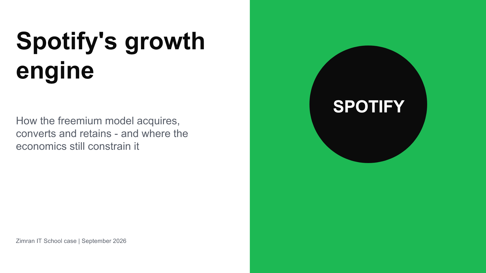
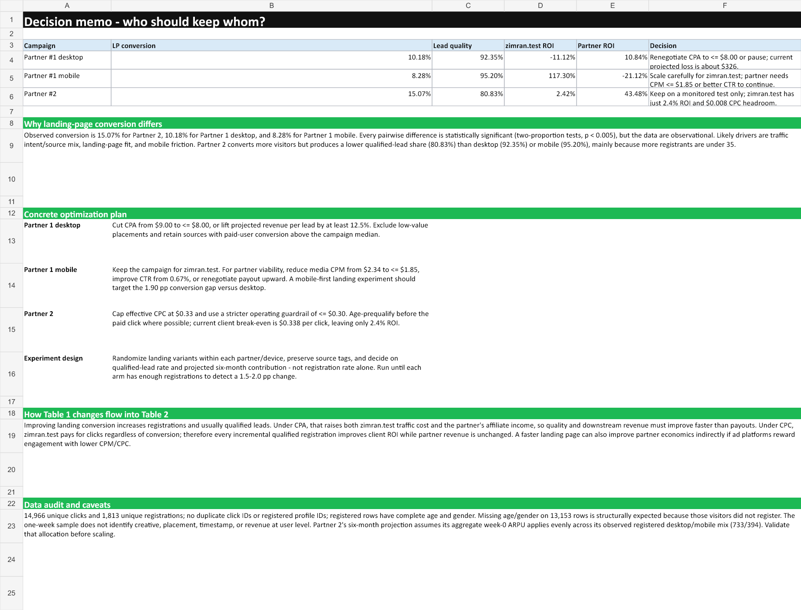

# Zimran IT School case study

This repository contains a complete response to the Zimran IT School test assignment: a reverse-engineered view of Spotify's growth model and a formula-driven evaluation of two traffic partners from both sides of the commercial relationship.

## Start here

| Final deliverable | Best for | Open |
|---|---|---|
| Spotify growth analysis | Primary presentation submission | [View or download PDF](deliverables/Spotify_Growth_Engine_Analysis.pdf) |
| Editable Spotify deck | Reviewing slide structure and source notes | [Download PPTX](deliverables/Spotify_Growth_Engine_Analysis.pptx) |
| Partner economics model | Reviewing formulas, assumptions, and decisions | [Download XLSX](deliverables/Zimran_Partner_Economics.xlsx) |

The [requirement-by-requirement audit](docs/DELIVERABLE_AUDIT.md) maps every prompt in the assignment to a slide or workbook range.

### The case in 60 seconds

- Spotify's free tier works as a low-friction acquisition and learning system. Subscription revenue captures most of the value, while content rights constrain margin.
- Partner 1 desktop loses money for zimran.test, while Partner 1 mobile creates strong client economics but loses money for the partner.
- Partner 2 remains profitable from both viewpoints, but zimran.test has only $0.008 of CPC headroom, so it should remain a monitored test rather than scale immediately.

[](deliverables/Spotify_Growth_Engine_Analysis.pdf)

[](deliverables/Zimran_Partner_Economics.xlsx)

## Contents

- [Executive summary](#executive-summary)
- [Key findings](#key-findings)
- [Methodology](#methodology)
- [Data dictionary](#data-dictionary)
- [Repository structure](#repository-structure)
- [Setup and reproducibility](#setup)
- [Sources](#sources)
- [Limitations and next steps](#limitations-and-next-steps)

## Executive summary

The two tasks point to the same operating principle: a high top-of-funnel conversion rate is useful only when it compounds into attractive downstream economics.

Spotify demonstrates that principle at platform scale. Its free tier is not merely a cheaper product; it is an acquisition surface, a source of preference data, and a persistent upgrade path. At Q2 2026 Spotify reported 777 million monthly active users, 300 million Premium subscribers, €4.777 billion of quarterly revenue, and a 33.4% gross margin. Revenue grew 14% year over year, faster than the 6.4% growth of the global recorded-music market in calendar 2025, but ad-supported users grew faster than Premium subscribers. The model is strengthening, while rights-holder costs and the monetization mix remain structural constraints.

The partner analysis reaches a deliberately asymmetric conclusion:

- **Partner 1 desktop:** unprofitable for zimran.test at **-11.1% projected six-month ROI**, but profitable for the partner at **+10.8% ROI**. Renegotiate CPA from $9.00 to no more than approximately $8.00, improve downstream value by at least 12.5%, or pause.
- **Partner 1 mobile:** highly profitable for zimran.test at **+117.3%**, but unprofitable for the partner at **-21.1%**. Keep the traffic, while recognizing the partner must reduce its media CPM from $2.34 to about $1.85, improve CTR, or renegotiate payout.
- **Partner 2 CPC:** profitable on both sides, but with very different cushions: **+2.4% for zimran.test** versus **+43.5% for the partner**. Continue only as a monitored test because the client's break-even CPC is approximately $0.338 against a current $0.33 payout.

## Supporting analytical outputs

- [`campaign_summary.csv`](outputs/analysis/campaign_summary.csv), [`conversion_tests.csv`](outputs/analysis/conversion_tests.csv), [`break_even_scenarios.csv`](outputs/analysis/break_even_scenarios.csv), and [`data_audit.json`](outputs/analysis/data_audit.json) - machine-readable analytical outputs.

## Key findings

### Spotify

1. **The free product is the distribution engine.** It lowers the cost of trial, creates in-product upgrade inventory, and supplies behavioral data that improves personalization.
2. **Growth is high quality, but the mix deserves attention.** Q2 2026 revenue grew 14% YoY and gross margin expanded 193 basis points. Premium subscribers grew 9%, while ad-supported MAUs grew 14% and ad-supported revenue grew only 1%.
3. **Margin is structurally bounded by content economics.** Approximately 66.6% of Q2 2026 revenue remained in cost of revenue. The 2025 Form 20-F identifies music royalties, audiobook licensing, creator-program costs, payment processing, and streaming delivery among the main drivers.
4. **Acquisition is product-led and ecosystem-led.** Freemium, compatibility across more than 2,000 devices, creator/cultural reach, partnerships, and trials form a reinforcing distribution system. Spotify does not disclose marketing spend by acquisition channel, so the deck treats any claim about paid-social dependence as an inference rather than a reported fact.
5. **Discover Weekly is a retention loop, not simply a recommendation feature.** Listening improves the model, a Monday refresh creates a predictable trigger, and novelty arrives without search effort. The primary operating metric should be listening days per MAU, supported by playlist starts, saves, completion, 28-day retention, and churn.

### Partner economics

| Campaign | Clicks | Registrations | Qualified leads | LP conversion | Lead quality | zimran.test ROI | Partner ROI |
|---|---:|---:|---:|---:|---:|---:|---:|
| Partner 1 desktop | 3,467 | 353 | 326 | 10.18% | 92.35% | -11.12% | 10.84% |
| Partner 1 mobile | 4,020 | 333 | 317 | 8.28% | 95.20% | 117.30% | -21.12% |
| Partner 2 CPC | 7,479 | 1,127 | 911 | 15.07% | 80.83% | 2.42% | 43.48% |

All pairwise landing-page conversion differences are statistically significant in two-proportion tests (the largest p-value is 0.00453). That does **not** establish causality: the file contains no creative, placement, source, timestamp, or experiment-assignment fields. Partner 2's stronger registration rate also comes with weaker qualified-lead yield, largely because more registrants are under 35.

## Methodology

### Data audit and cleaning

The raw `Data` sheet contains 14,966 click-level rows. The pipeline:

1. reads only the seven analytical fields from the workbook;
2. normalizes categorical whitespace and gender casing;
3. coerces age to numeric without imputing missing values;
4. defines registration as a non-null `profile_id`;
5. defines a qualified lead exactly as stated in the brief: registered, male, age 35 or older, and located in the United States, Canada, United Kingdom, Australia, or New Zealand;
6. classifies Android, iOS, Blackberry, and Windows Phone as mobile, with other observed operating systems treated as desktop;
7. checks click/profile uniqueness, registered demographic completeness, partner coverage, and operating-system values.

The 13,153 missing age and gender values occur on unregistered clicks and are therefore structural, not imputed data defects. Registered users have complete age and gender, and there are no duplicate click IDs or duplicate registered profile IDs.

### Economic model

For zimran.test:

```text
week-0 income = registrations × week-0 ARPU
six-month income = week-0 income × device return multiplier
ROI = (six-month income - traffic cost) / traffic cost
```

Partner 1 traffic cost is qualified leads multiplied by CPA. Partner 2 traffic cost is clicks multiplied by the $0.33 CPC payout. For Partner 2, its aggregate week-0 ARPU is allocated evenly across the observed registered device mix (733 desktop and 394 mobile) before applying the 8.3 desktop and 4.0 mobile multipliers. This is the narrowest assumption supported by the available data and should be replaced with user-level revenue when available.

For each traffic partner:

```text
Partner 1 media cost = impressions / 1,000 × CPM
Partner 2 media cost = clicks × media CPC
affiliate income = amount paid by zimran.test
partner ROI = (affiliate income - media cost) / media cost
```

Break-even rates are solved directly from these formulas. Wilson 95% intervals describe conversion uncertainty, and two-sided pooled two-proportion tests assess whether observed campaign conversion rates plausibly differ by chance.

### Practical decision rule

The assignment uses ROI greater than zero as the keep/drop rule. In practice, Partner 2 should not be scaled at a 2.4% projected client margin: a small tracking change, cohort-mix shift, or return-multiplier error could reverse the decision. A positive ROI is necessary, not sufficient; a production guardrail should include a risk buffer and cohort maturation check.

## Data dictionary

### Raw click data

| Field | Meaning | Analytical treatment |
|---|---|---|
| `click_id` | Unique advertising click identifier | Primary event key; checked for duplicates |
| `profile_id` | Assigned after landing-page registration | Non-null value defines a registration |
| `partner_id` | Campaign/partner identifier | `1_desktop`, `1_mobile`, or `2_cpc` |
| `country` | Country recorded for the click | Tested against the five-country lead rule |
| `age` | Age entered during registration | Numeric; required for a qualified lead |
| `gender` | Gender entered during registration | Normalized to lowercase; `male` required for a lead |
| `OS` | User operating system | Mapped to desktop/mobile for the return multiplier |

### Derived metrics

| Metric | Definition |
|---|---|
| Landing-page conversion | Registrations / clicks |
| Lead quality | Qualified leads / registrations |
| Estimated paying users | Rounded week-0 income / ARPPU; descriptive because source rates are rounded |
| Week-0 income | Registrations × ARPU |
| Six-month income | Device-level week-0 income × applicable return multiplier |
| Traffic cost | CPA × leads for Partner 1; payout CPC × clicks for Partner 2 |
| Client ROI | (Six-month income - traffic cost) / traffic cost |
| Partner budget | CPM-based impression spend or CPC-based click spend |
| Affiliate income | Traffic cost paid by zimran.test |
| Partner ROI | (Affiliate income - partner budget) / partner budget |

## Repository structure

```text
data/raw/                      Original brief and source workbook
deliverables/                  Final PDF, editable deck, and Excel model
docs/                          Requirement audit and README preview images
src/analysis.py                Cleaning, audit, statistics, ROI, and scenarios
scripts/build_workbook.mjs     Rebuilds the formula-driven Excel deliverable
scripts/build_presentation.mjs Rebuilds the PowerPoint deliverable
scripts/export_presentation_pdf.ps1  Exports the PPTX to PDF with PowerPoint
tests/test_analysis.py         Data-integrity and reconciliation checks
outputs/analysis/              CSV and JSON analytical results
```

## Setup

Python 3.11+ is recommended.

```powershell
python -m venv .venv
.\.venv\Scripts\Activate.ps1
python -m pip install -r requirements.txt
```

The final Office artifacts were authored with Codex's bundled `@oai/artifact-tool` runtime. The Python analysis is independent of that runtime and can be reproduced with the public requirements file.

## Reproducibility

Run the analytical pipeline and checks from the repository root:

```powershell
python src\analysis.py
python -m unittest discover -s tests -v
```

The pipeline overwrites only the four files in `outputs/analysis/`. The Excel formulas independently recompute the same click, registration, lead, revenue, cost, and ROI values from the raw `Data` sheet.

To rebuild the Office artifacts inside a Codex workspace with the bundled runtime available:

```powershell
node scripts\build_workbook.mjs
node scripts\build_presentation.mjs
powershell -ExecutionPolicy Bypass -File scripts\export_presentation_pdf.ps1
```

The PDF export step requires Microsoft PowerPoint on Windows. The checked-in PDF remains available for environments without PowerPoint.

## Sources

- [Zimran assignment source workbook](https://docs.google.com/spreadsheets/d/1dFaeZ4ZLhWCbVRngt9c8LzqWPF6Rzwlu4G6alecvobk/edit?gid=1357984062#gid=1357984062)
- [Spotify Q2 2026 shareholder update](https://www.sec.gov/Archives/edgar/data/1639920/000114036126031044/ef20078867_ex99-1.htm)
- [Spotify 2025 Form 20-F](https://www.sec.gov/Archives/edgar/data/1639920/000162828026006874/ck0001639920-20251231.htm)
- [Spotify Premium U.S. pricing and benefits](https://www.spotify.com/us/premium/)
- [IFPI Global Music Report 2026 release](https://www.ifpi.org/global-music-report-2026-global-recorded-music-revenues-grow-6-4-as-record-companies-drive-innovation/)
- [Spotify Engineering: Discover Weekly](https://engineering.atspotify.com/2015/11/what-made-discover-weekly-one-of-our-most-successful-feature-launches-to-date)
- [Spotify Engineering: algotorial playlists](https://engineering.atspotify.com/2023/04/humans-machines-a-look-behind-spotifys-algotorial-playlists)

## Attribution and data use

The assignment brief and source workbook belong to their respective authors and are included only to make this educational case study auditable. This repository does not claim ownership of Spotify trademarks, Zimran materials, or third-party data, and it does not grant a separate license for those source materials.

## Limitations and next steps

- Replace aggregate ARPU/ARPPU with user-level revenue and cohort survival data.
- Add creative, placement, timestamp, source, and geo-granular cost fields.
- Re-estimate six-month value from observed cohorts rather than fixed multipliers.
- Run randomized landing-page tests within partner-device strata.
- Introduce operational ROI floors above zero to cover attribution error and cohort variance.
